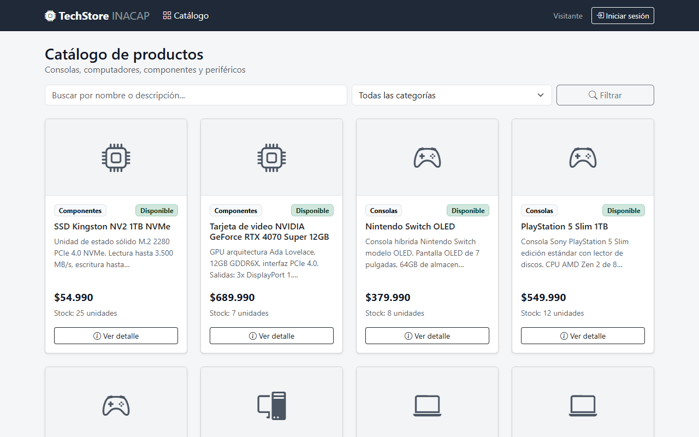
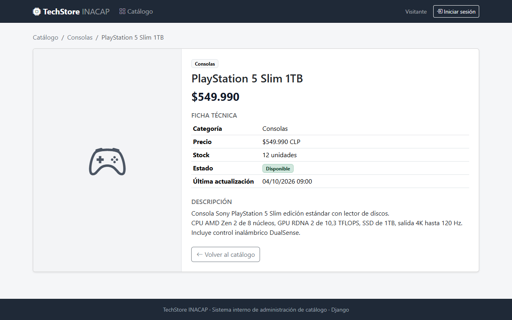
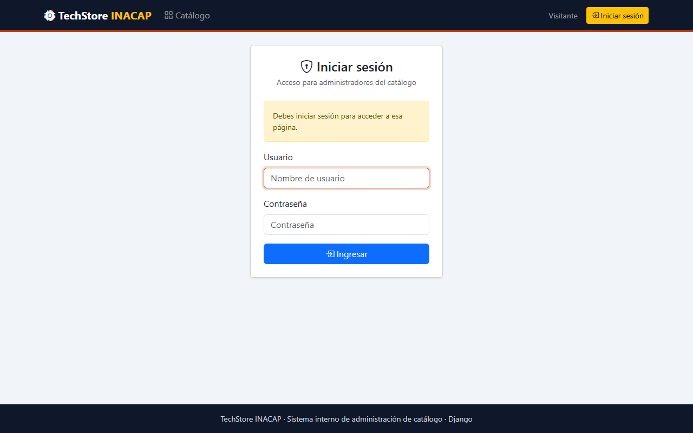
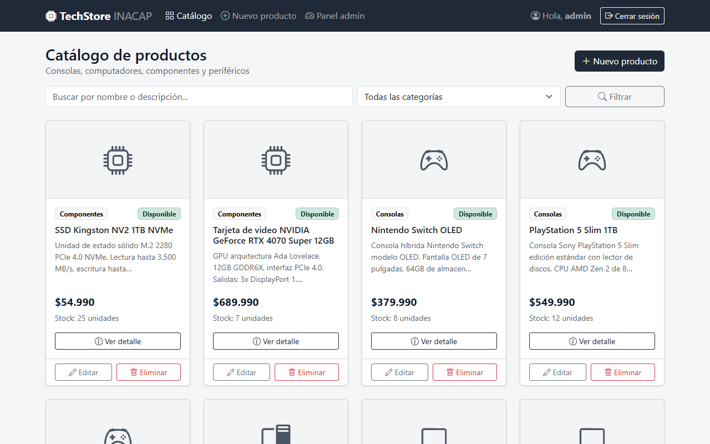
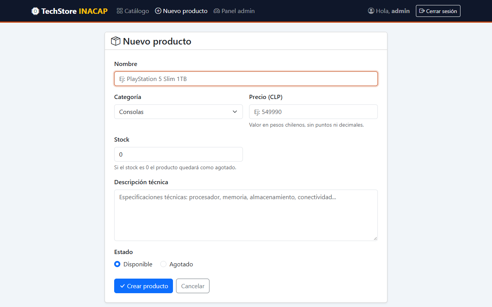
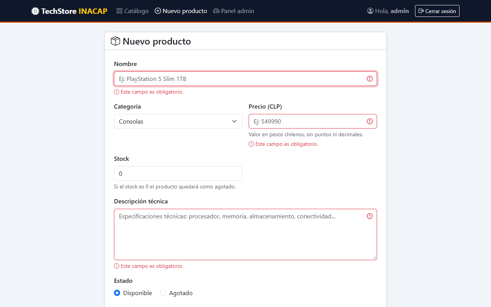
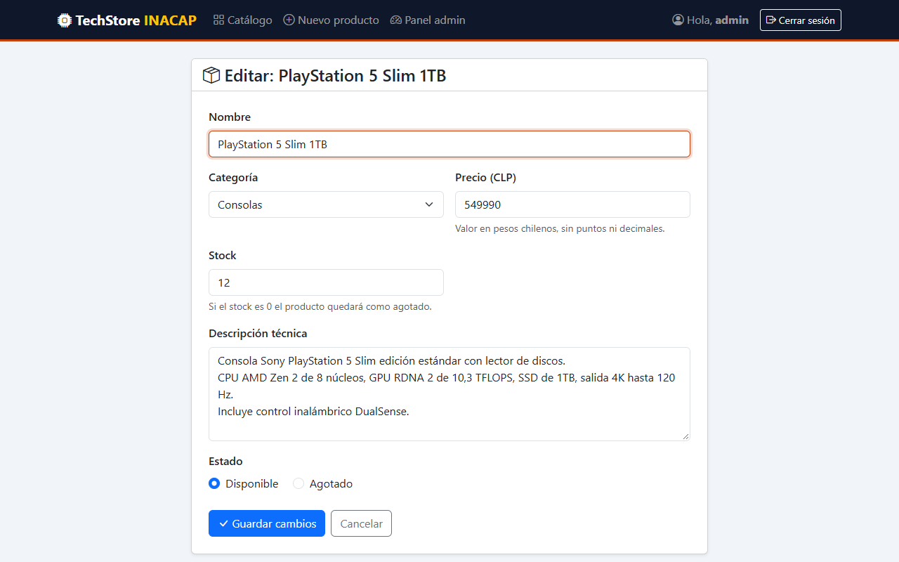
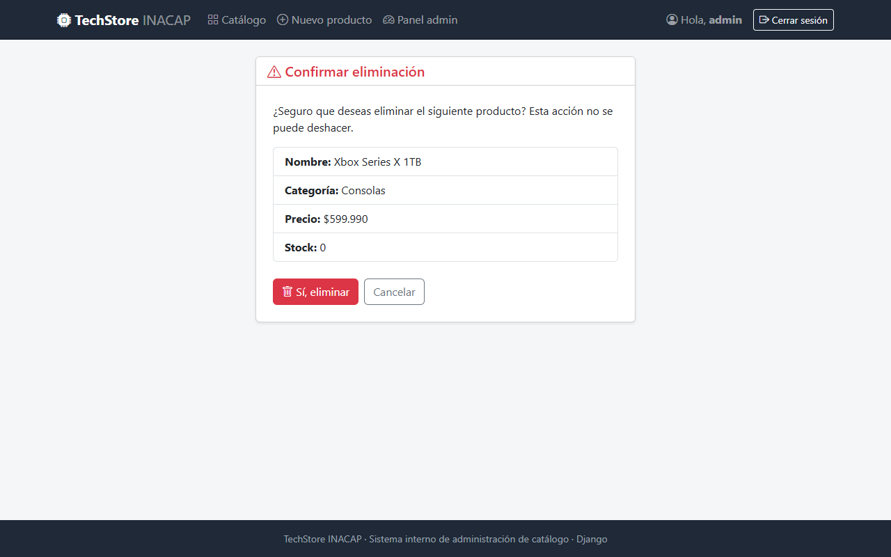
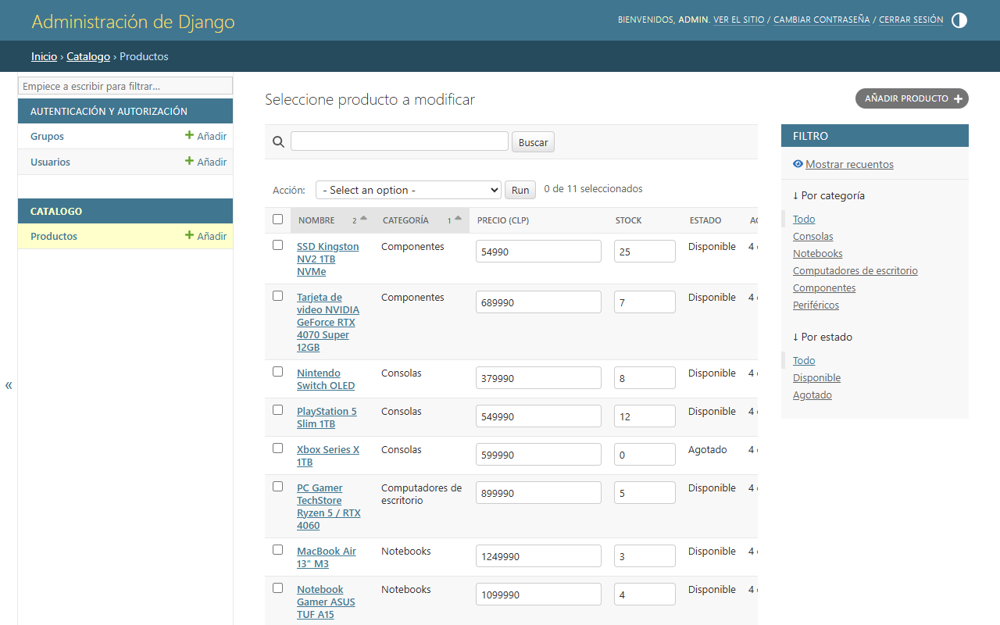
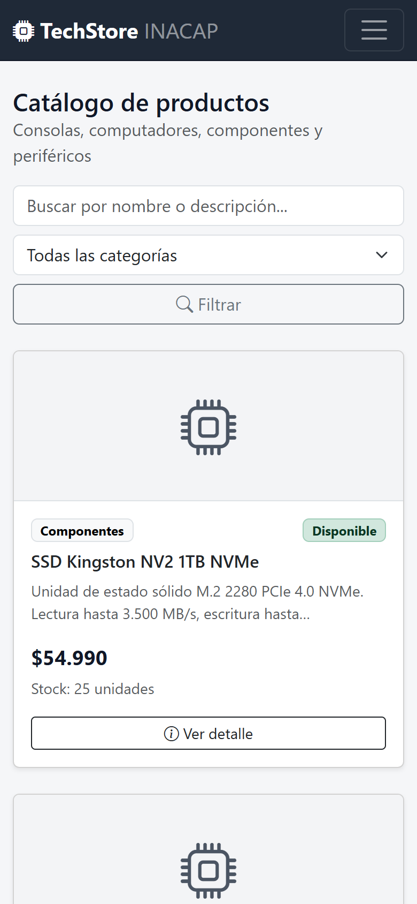

# Documentación del desarrollo – TechStore INACAP

**Autor:** MauExpl01t
**Asignatura:** Desarrollo Web / Framework Django
**Evaluación:** Encargo Práctico CRUD Ventas

Este documento describe paso a paso cómo se construyó el sistema, qué decisiones se tomaron
y cómo se verificó que funcionara. Las instrucciones para ejecutarlo están en el [README](../README.md).

---

## Índice

1. [Objetivo](#1-objetivo)
2. [Tecnologías utilizadas](#2-tecnologías-utilizadas)
3. [Proceso de desarrollo paso a paso](#3-proceso-de-desarrollo-paso-a-paso)
4. [Capturas de pantalla](#4-capturas-de-pantalla)
5. [Pruebas realizadas](#5-pruebas-realizadas)
6. [Decisiones de diseño](#6-decisiones-de-diseño)

---

## 1. Objetivo

La empresa **TechStore INACAP** necesita un sistema web interno para administrar su catálogo
de productos electrónicos (consolas, computadores, componentes y periféricos).
Cualquier persona puede ver el catálogo, pero solo los usuarios que inician sesión pueden
**crear, modificar y eliminar** productos.

---

## 2. Tecnologías utilizadas

| Tecnología | Uso |
|------------|-----|
| Python 3 | Lenguaje de programación |
| Django 5.2 LTS | Framework web (modelos, vistas, plantillas, autenticación, admin) |
| MySQL 8.0 | Motor de base de datos |
| mysqlclient | Conector que permite a Django comunicarse con MySQL |
| python-dotenv | Lee las credenciales de MySQL desde el archivo `.env` |
| MySQL Workbench | Interfaz gráfica para administrar y revisar la base de datos |
| Bootstrap 5 + Bootstrap Icons | Diseño de la interfaz (cargados por CDN) |
| Git | Control de versiones |

---

## 3. Proceso de desarrollo paso a paso

### Paso 1 – Entorno virtual e instalación de Django

Se creó un entorno virtual para aislar las dependencias del proyecto y se instaló Django:

```bash
python -m venv venv
.\venv\Scripts\Activate.ps1
pip install "django>=5.2,<5.3" mysqlclient python-dotenv
pip freeze > requirements.txt
```

- Se usa **Django 5.2 LTS** porque es compatible con MySQL 8.0 (Django 6 exige MySQL 8.4 o superior)
  y tiene soporte extendido hasta abril de 2028.
- `mysqlclient` es el conector de MySQL que recomienda la documentación de Django.
- `requirements.txt` guarda las versiones exactas, para que cualquiera pueda reproducir el entorno
  con `pip install -r requirements.txt`.

### Paso 2 – Creación del proyecto y la app

```bash
django-admin startproject techstore_project .
python manage.py startapp catalogo
```

- `techstore_project` contiene la configuración general (`settings.py`, `urls.py`).
- `catalogo` es la app con la lógica del negocio (modelo, vistas, formularios y plantillas).

### Paso 3 – Configuración (`techstore_project/settings.py`)

- Se registró la app en `INSTALLED_APPS` agregando `'catalogo'`.
- Idioma y zona horaria de Chile: `LANGUAGE_CODE = 'es-cl'` y `TIME_ZONE = 'America/Santiago'`.
  Así los mensajes de validación de Django aparecen en español.
- Configuración de autenticación:

```python
LOGIN_URL = 'login'                        # a dónde se envía al usuario sin sesión
LOGIN_REDIRECT_URL = 'catalogo:lista'      # a dónde va después de iniciar sesión
LOGOUT_REDIRECT_URL = 'catalogo:lista'     # a dónde va después de cerrar sesión
```

- Base de datos MySQL. Primero se creó la base y un usuario propio para el proyecto con el script
  `mysql/crear_base_datos.sql`, ejecutado como `root` (por terminal o desde MySQL Workbench):

```sql
CREATE DATABASE IF NOT EXISTS techstore_db CHARACTER SET utf8mb4 COLLATE utf8mb4_unicode_ci;
CREATE USER IF NOT EXISTS 'techstore_user'@'localhost' IDENTIFIED BY '...';
GRANT ALL PRIVILEGES ON techstore_db.* TO 'techstore_user'@'localhost';
```

  Luego se configuró la conexión en `settings.py`. Las credenciales no se escriben en el código:
  se leen del archivo `.env` (que no se sube a Git) con `python-dotenv`:

```python
DATABASES = {
    'default': {
        'ENGINE': 'django.db.backends.mysql',
        'NAME': os.getenv('DB_NAME', 'techstore_db'),
        'USER': os.getenv('DB_USER', 'techstore_user'),
        'PASSWORD': os.getenv('DB_PASSWORD', ''),
        'HOST': os.getenv('DB_HOST', 'localhost'),
        'PORT': os.getenv('DB_PORT', '3306'),
        'OPTIONS': {'charset': 'utf8mb4'},
    }
}
```

  - Se usa un usuario propio (`techstore_user`) y no `root`: solo tiene permisos sobre `techstore_db`.
  - `utf8mb4` permite guardar cualquier carácter (tildes, ñ, símbolos).

### Paso 4 – Modelo `Producto` (`catalogo/models.py`)

Se definió el modelo con los campos que pide el encargo, eligiendo el tipo de dato adecuado para cada uno:

| Campo | Tipo de Django | Por qué |
|-------|----------------|---------|
| `nombre` | `CharField(max_length=120)` | Texto corto |
| `categoria` | `CharField` con `choices` | Solo permite categorías válidas y genera una lista desplegable |
| `precio` | `DecimalField(max_digits=10, decimal_places=0)` | Valor monetario exacto (el peso chileno no usa decimales) |
| `stock` | `IntegerField` con `MinValueValidator(0)` | Número entero, no puede ser negativo |
| `descripcion` | `TextField` | Texto largo para la ficha técnica |
| `estado` | `BooleanField` con choices | `True` = Disponible, `False` = Agotado |
| `creado` / `actualizado` | `DateTimeField` | Fechas automáticas de auditoría |

Además se agregó:

- **Regla de negocio** en `save()`: si el stock es 0, el producto queda automáticamente como agotado.
- `get_absolute_url()`: devuelve la URL del detalle, para redirigir después de crear o editar.
- La propiedad `icono`: el ícono que se muestra en la tarjeta según la categoría.

### Paso 5 – Migraciones

```bash
python manage.py makemigrations
python manage.py migrate
```

- `makemigrations` generó `catalogo/migrations/0001_initial.py` a partir del modelo.
- `migrate` creó las tablas en la base `techstore_db` de MySQL (las de Django y la tabla
  `catalogo_producto`). Se pueden ver en MySQL Workbench, en el panel **Schemas**.

### Paso 6 – Panel administrativo (`catalogo/admin.py`)

Se registró el modelo en el admin de Django con columnas, filtros, búsqueda y edición rápida
de precio y stock (`list_display`, `list_filter`, `search_fields`, `list_editable`).

### Paso 7 – Formularios (`catalogo/forms.py`)

Se creó `ProductoForm`, un **`ModelForm`**: Django genera los campos a partir del modelo, y con
`widgets` se personaliza cómo se dibuja cada uno en HTML:

| Campo | Widget | Clase CSS |
|-------|--------|-----------|
| nombre | `TextInput` | `form-control` + placeholder |
| categoria | `Select` (lista desplegable) | `form-select` |
| precio, stock | `NumberInput` | `form-control` + `min` |
| descripcion | `Textarea` | `form-control` + `rows=5` |
| estado | `RadioSelect` (selección) | `form-check-input` |

También se agregó:

- `clean_nombre()`: validación personalizada (mínimo 3 caracteres).
- `_post_clean()`: agrega la clase `is-invalid` a los campos con error para mostrarlos en rojo.
- `LoginForm`: hereda de `AuthenticationForm` (de `django.contrib.auth`) solo para darle clases CSS
  a los campos de usuario y contraseña.

### Paso 8 – Vistas (`catalogo/views.py`)

Se usaron vistas basadas en funciones:

| Vista | Tipo | Qué hace |
|-------|------|----------|
| `lista_productos` | Pública | Lista los productos; permite buscar por texto y filtrar por categoría |
| `detalle_producto` | Pública | Muestra la ficha técnica (`get_object_or_404`) |
| `crear_producto` | **Privada** | GET muestra el formulario vacío; POST valida y guarda |
| `editar_producto` | **Privada** | Igual que crear, pero con `instance=producto` |
| `eliminar_producto` | **Privada** | GET muestra la confirmación; **solo POST elimina** |

Las vistas privadas usan el decorador **`@login_required`**. Si un usuario sin sesión intenta entrar,
Django lo redirige a `/login/?next=<url>` y, después de iniciar sesión, lo devuelve a la página que pidió.

Después de crear, editar o eliminar, se muestra un mensaje de confirmación con el framework de
mensajes de Django (`messages.success`).

### Paso 9 – URLs

`catalogo/urls.py` (con `app_name = 'catalogo'` para usar nombres como `catalogo:detalle`):

```python
path('', views.lista_productos, name='lista'),
path('producto/<int:pk>/', views.detalle_producto, name='detalle'),
path('producto/nuevo/', views.crear_producto, name='crear'),
path('producto/<int:pk>/editar/', views.editar_producto, name='editar'),
path('producto/<int:pk>/eliminar/', views.eliminar_producto, name='eliminar'),
```

`techstore_project/urls.py` agrega el admin, el login y el logout de `django.contrib.auth`:

```python
path('login/', auth_views.LoginView.as_view(
    template_name='registration/login.html',
    authentication_form=LoginForm,
    redirect_authenticated_user=True,
), name='login'),
path('logout/', auth_views.LogoutView.as_view(), name='logout'),
```

### Paso 10 – Plantillas (`catalogo/templates/`)

- **`base.html`** es el layout principal: contiene el `<head>`, la barra de navegación, los mensajes
  y el pie de página. Define el bloque ``.
- Todas las demás plantillas empiezan con `` y solo rellenan su contenido
  (**herencia de plantillas**).
- **Barra de navegación dinámica:** usa ``:
  - Visitante → muestra "Visitante" y el botón *Iniciar sesión*.
  - Usuario autenticado → muestra *Nuevo producto*, *Panel admin* (solo si es staff),
    "Hola, *usuario*" y *Cerrar sesión*.
- El botón *Cerrar sesión* es un formulario **POST** con ``, porque desde
  Django 5 el logout ya no acepta GET.
- `lista.html` presenta los productos en **tarjetas (cards)** dentro de una grilla de Bootstrap;
  cada tarjeta tiene un ícono según la categoría (consola, notebook, PC, etc.).

### Paso 11 – Estilos y formato de precios

- `catalogo/static/catalogo/css/estilos.css`: paleta sobria en grises, sombra suave al pasar el mouse
  sobre las tarjetas y estilos de foco en los formularios.
- `catalogo/templatetags/formato.py`: filtro propio `|clp` que muestra los precios
  con formato chileno (`549990` → `$549.990`).

### Paso 12 – Datos de ejemplo y superusuario

```bash
python manage.py loaddata productos
python manage.py createsuperuser
```

- `catalogo/fixtures/productos.json` contiene 11 productos reales de ejemplo
  (PS5, Switch OLED, Xbox Series X, notebooks, RTX 4070, etc.).
- Superusuario de prueba: **`admin` / `admin`**.

### Paso 13 – Pruebas automatizadas y control de versiones

```bash
python manage.py test catalogo
git init
git add .
git commit -m "Proyecto TechStore INACAP: CRUD de productos con Django"
```

---

## 4. Capturas de pantalla

### Catálogo como visitante (sin sesión)
Barra de navegación con "Visitante" e "Iniciar sesión". No aparecen botones de edición.



### Detalle técnico de un producto



### Protección con `@login_required`
Al intentar entrar a `/producto/nuevo/` sin sesión, el sistema redirige al login.



### Catálogo con sesión iniciada
La barra cambia: aparecen "Nuevo producto", "Panel admin", el saludo y "Cerrar sesión".
Cada tarjeta muestra los botones Editar y Eliminar.



### Formulario de creación (ModelForm con widgets)



### Validación del formulario
Al enviarlo vacío, los campos obligatorios se marcan en rojo con el mensaje de error.



### Formulario de edición



### Confirmación de eliminación



### Panel administrativo de Django



### Vista en celular (diseño responsivo)



---

## 5. Pruebas realizadas

### Pruebas automatizadas (`catalogo/tests.py`)

```bash
python manage.py test catalogo
```

Resultado: **8 pruebas, todas correctas (OK)**.

| Prueba | Qué verifica |
|--------|--------------|
| `test_stock_cero_queda_agotado` | Un producto con stock 0 se guarda como agotado |
| `test_lista_publica` | El catálogo se ve sin iniciar sesión |
| `test_detalle_publico` | El detalle se ve sin iniciar sesión |
| `test_vistas_privadas_requieren_login` | Crear, editar y eliminar redirigen al login si no hay sesión |
| `test_crear_producto` | Se crea un producto y redirige a su detalle |
| `test_editar_producto` | Se modifica un producto existente |
| `test_eliminar_producto` | Se muestra la confirmación y se elimina con POST |
| `test_navbar_usuario_autenticado` | La barra muestra las opciones del usuario autenticado |

### Pruebas manuales en el navegador

- [x] El catálogo y el detalle se ven sin iniciar sesión.
- [x] Al entrar a una vista privada sin sesión se redirige al login.
- [x] El login con `admin` / `admin` funciona y vuelve a la página solicitada.
- [x] La barra de navegación cambia según el estado del usuario.
- [x] El formulario muestra errores en español y marca los campos en rojo.
- [x] Los productos guardados se ven tanto en el catálogo como en `/admin/`.
- [x] Cerrar sesión devuelve al catálogo como visitante.
- [x] El diseño se adapta a la pantalla del celular.

---

## 6. Decisiones de diseño

- **Vistas basadas en funciones** en lugar de clases: el flujo GET/POST queda explícito
  y se ve claramente dónde se aplica `@login_required`.
- **La eliminación solo ocurre con POST:** un enlace (GET) nunca borra datos; siempre pasa por
  la página de confirmación y el formulario lleva token CSRF.
- **`DecimalField` para el precio:** evita los errores de redondeo de `FloatField` en valores monetarios.
- **`choices` en la categoría:** evita categorías mal escritas y permite filtrar por categoría.
- **Una sola plantilla (`formulario.html`) para crear y editar:** la vista le pasa el título y el texto del botón.
- **Íconos por categoría en vez de imágenes:** no depende de archivos externos ni de instalar Pillow.

